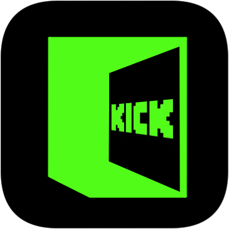

# kick-signal



Get notified when your favorite Kick streamers go live with auto-launch capability.

## Installation

* [Chrome Web Store]()

## Build

```shell
# build for production
npm run build-prod

# build for development w/ watch option
npm run build-dev

# clean
npm run clean
```

## License

kick-signal is under [MIT license](https://en.wikipedia.org/wiki/MIT_License).
